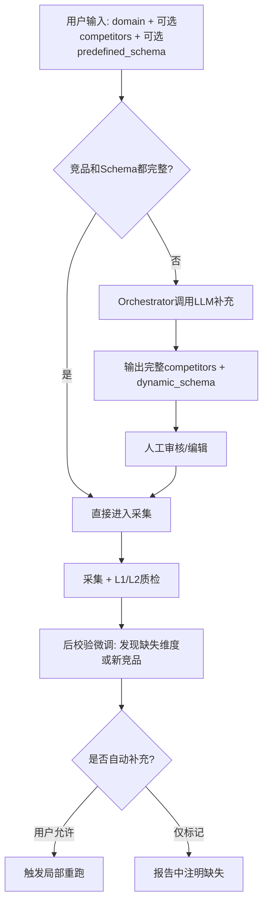
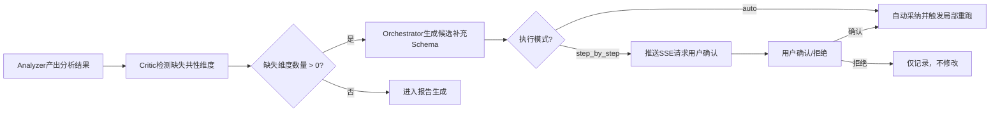

用户可能给出部分竞品、部分维度，甚至什么都不给。我们需要让系统既能利用用户输入，又能智能补充，同时保持流程的清晰可控。

## 核心设计思路：**基于已有信息的部分生成 + 差异化处理**

无论用户提供了多少信息，Orchestrator 的目标都是**产出一个完整、一致的（竞品列表 + Schema）**。流程如下：



下面详细说明每个环节。

---

## 一、Orchestrator 的智能补充逻辑（阶段0）

### 输入数据结构
```python
{
  "domain": "AI大模型",
  "user_provided_competitors": ["GPT-4o"],  # 可能为空列表或部分
  "user_provided_schema": {                  # 可能为None或部分字段
    "功能树": {"对话能力": {}, "文件处理": {}},
    # 缺少定价模型、用户画像等
  }
}
```

### LLM Prompt 设计（关键点：**约束补充方向**）

```text
你是竞品分析架构师。用户关注领域：{domain}。
用户已提供以下信息：
- 竞品列表：{user_provided_competitors}（可能不完整）
- 知识框架：{user_provided_schema}（可能不完整）

请完成补充任务：
1. 如果竞品列表缺失或过少，基于领域知识补充3-5个主流竞品，不要与已有竞品重复。
2. 如果知识框架缺失某些维度组（功能树、定价模型、用户画像等），补充合理的字段。
3. 补充时确保：
   - 新竞品与已有竞品在同一竞争层级（不引入无关产品）
   - 新维度字段对所有竞品（包括用户提供的）都有意义，避免出现“仅适用于某个新竞品”的特殊字段
   - 若用户已提供部分字段，保留它们，仅补充缺失部分，不修改用户已有内容

输出格式：
{
  "competitors": ["已有竞品1", "补充竞品2", ...],
  "schema": {
    "功能树": {...},   // 合并用户已有+补充
    "定价模型": {...},
    "用户画像": {...}
  }
}
```

**为什么这样设计？**  
- LLM 不会“推翻”用户输入，只会做**增量补充**，尊重用户专业性。  
- 补充时强制要求“对所有竞品有意义”，避免生成鸡肋字段。  
- 一次调用同时解决两个缺失，保持原子性。

### 后端实现伪代码
```python
def generate_complete_plan(domain, user_competitors, user_schema):
    prompt = build_prompt(domain, user_competitors, user_schema)
    response = llm.invoke(prompt)
    result = parse_json(response)
    
    # 合并：用户提供的优先级高于LLM补充（去重）
    final_competitors = list(set(user_competitors + result["competitors"]))
    final_schema = deep_merge(user_schema, result["schema"])  # 用户字段覆盖LLM同名字段
    
    return final_competitors, final_schema
```

---

## 二、人工审核界面增强（阶段1）

前端 Schema 编辑页面同时展示两部分内容：

| 区域     | 内容                                                         | 用户操作                                        |
| -------- | ------------------------------------------------------------ | ----------------------------------------------- |
| 竞品列表 | 合并后的完整列表，每一项标记来源（用户提供 / Agent补充）     | 可删除、添加竞品                                |
| 维度树   | 每个字段标记来源（用户预定义 / Agent补充），Agent补充的字段附带“置信度”或“依据” | 可增删改字段，若删除Agent补充字段，系统记录原因 |

这样用户一目了然：哪些是系统自动加的，如果不认可可以手动删除。

---

## 三、后校验微调（阶段3之后，最终报告前）

这是你关心的“采集后反过来修正Schema”的闭环。我们将其设计为**可选、受控**的步骤，避免无限循环。

### 触发条件
当 Critic Agent 在L2质检中发现以下情况时：
- 多个竞品共同拥有某个特征，但当前 schema 中没有对应字段（例如所有竞品都有“开源协议”，但 schema 只有“定价模型”）
- 某个竞品有显著差异化的维度，但其他竞品没有，可放入“扩展属性”

### 流程设计



### 实现细节

1. **Critic 输出增强**：除了原有的反馈，增加一个字段 `suggested_schema_extensions`，结构如下：
   ```json
   {
     "dimension_group": "功能树",
     "new_field": "开源协议支持",
     "evidence": ["GPT-4o官网提到支持MIT协议", "Claude文档显示Apache 2.0"],
     "affected_competitors": ["GPT-4o", "Claude", "Gemini"]
   }
   ```

2. **Orchestrator 处理**：
   - 若 `execution_mode = "auto"` 且建议的置信度 > 阈值（例如0.8），自动合并到 `dynamic_schema`，并触发局部重跑（仅采集新增字段）。
   - 若 `step_by_step`，则挂起状态机，发送 `event: schema_extension_request`，等待用户通过 API 确认或拒绝。
   - 用户拒绝时，将拒绝记录到 `intervention_logs`，并在最终报告中注明“用户选择不分析XX维度”。

3. **局部重跑范围**：只针对新增字段，不重新抓取已有数据（节省Token和时间）。

---

## 四、与已有后端设计的兼容性

你提供的 `后端需求-新.md` 中已经包含了必要的扩展点：

- `POST /api/v1/tasks/{id}/intervention` 可以扩展为接受 `extend_schema` 动作。
- `partial_rerun` 接口天然支持只重跑特定模块。
- `dynamic_schema` 是 `jsonb` 字段，可以随时更新，且保留版本历史（通过 `analysis_results.version`）。
- `execution_mode` 字段已经区分 auto / step_by_step，可以控制后校验是否自动。

因此，这套方案不需要改动状态机核心，只需在 `ANALYZING` 节点后增加一个可选的 `SCHEMA_EXTENSION` 节点（非强制），或在 `ANALYZING` 内部增加一个子流程。

---

## 五、评委视角的优势

| 考察要点        | 本方案如何体现                                               |
| --------------- | ------------------------------------------------------------ |
| **多Agent协作** | Orchestrator + Critic 协同完成 schema 演化，形成真实反馈闭环 |
| **输出可信度**  | 后校验的每个建议都带有证据（`evidence` 字段），人工可追溯    |
| **技术深度**    | 实现了“自适应 Schema 演化”，属于前瞻性思考（评分表加分项）   |
| **产品体验**    | 用户既可以完全托管（auto模式），也可以精细控制（step_by_step），且始终能看到系统建议的依据 |
| **工程完整度**  | 完全复用已有 API 和状态机，无侵入式改动                      |

---

## 总结：最终方案

1. **初始化阶段**：Orchestrator 基于用户提供的部分竞品/部分 schema，调用 LLM 补充完整（一次调用）。
2. **人工审核**：用户可修改、确认最终版本。
3. **采集与分析**：按确认后的 schema 执行。
4. **后校验微调**：Critic 检测共性缺失维度，生成带证据的建议，根据执行模式自动或人工确认后触发局部重跑。

这样就完美解决了“鸡生蛋、蛋生鸡”的问题，同时支持用户灵活输入，并实现了真正有价值的闭环反馈。