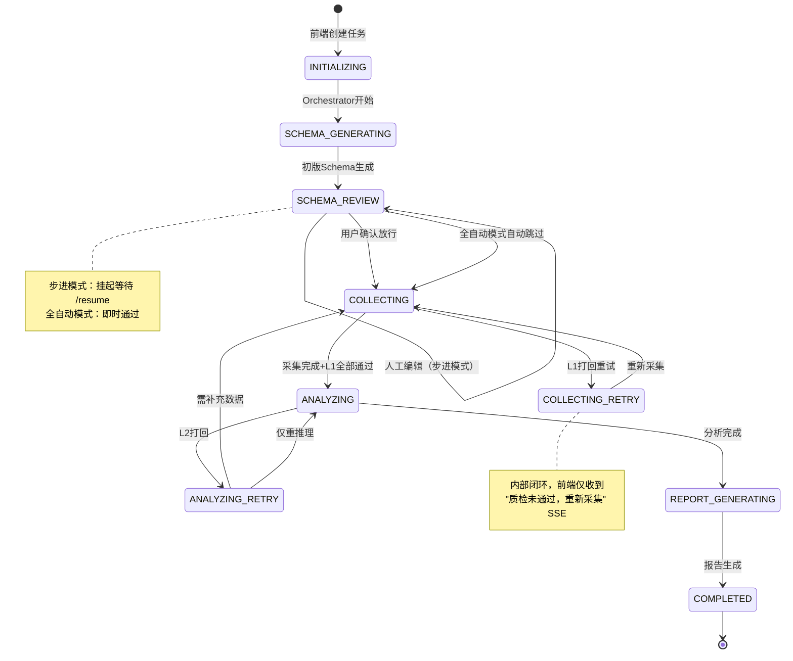

该工作流基于 **LangGraph** 状态机，通过 **Orchestrator Agent** 统一调度，并暴露 REST API 与 SSE 事件流供前端消费。

# 一、核心组件清单

| 组件                      | 职责                                                   | 对应前端模块                     |
| ------------------------- | ------------------------------------------------------ | -------------------------------- |
| **API Gateway (FastAPI)** | 接收前端请求，管理任务生命周期，透传SSE事件            | 所有页面                         |
| **Orchestrator Agent**    | 任务拆解、动态生成Schema、路由控制、人工断点挂起/恢复  | 左侧导航栏、步进确认弹窗         |
| **Collector Agent**       | 网页抓取、解析、信息抽取、L1规则校验                   | 信息采集看板、数据底座干预视图   |
| **Analyzer Agent**        | 竞品对比、SWOT推导、结构化报告生成                     | 竞品深度分析、SWOT、结构化报告   |
| **Critic Agent**          | 语义质检（L2），输出修正意见                           | 异常提示、质检角标               |
| **State Graph**           | 全局状态存储（Checkpoint机制），支持断点续跑与局部重跑 | 执行历史与快照回溯、局部重跑配置 |
| **PostgreSQL + Redis**    | 持久化任务/状态/数据快照 + 实时事件广播                | 所有历史数据查询                 |
| **LangSmith**             | 链路追踪，记录每个Agent的输入输出、Token消耗、耗时     | 调试面板、Agent Trace            |

---

# 二、任务状态机定义（State Graph）

整个任务生命周期由 `TaskState` 枚举驱动，状态流转如下：



# 三、全流程详细步骤（按前端页面映射）

#### 阶段 0：任务创建与初始化（对应前端“新建/配置任务”）

| 步骤 | 动作             | 后端行为                                                     | 前端表现                                    |
| ---- | ---------------- | ------------------------------------------------------------ | ------------------------------------------- |
| 0.1  | 用户提交竞品指令 | `POST /api/v1/tasks`<br>• 入库初始记录（state=INITIALIZING）<br>• 生成 task_id<br>• 唤醒 Orchestrator 执行图 | 跳转到任务控制台，显示骨架屏，建立 SSE 连接 |
| 0.2  | 建立 SSE 通道    | `GET /api/v1/tasks/{id}/stream`<br>• 订阅 Redis 频道 `task:{id}:events`<br>• 返回 `text/event-stream` | 页面实时接收进度、日志、Token 等信息        |
| 0.3  | 动态 Schema 生成 | Orchestrator 根据初始指令调用 LLM 生成初版 `dynamic_schema`<br>• 包含五层导航所需的所有维度组、字段、类型、可信度要求 | 无直接展示（等待 Schema 审核）              |

**API 设计（阶段0）**

```
POST /api/v1/tasks
Request Body:
{
  "task_name": "AI大模型竞品分析_20260115",
  "domain": "AI大模型",
  "competitors": ["GPT-4o", "Claude 3.5", "Gemini 1.5"],
  "execution_mode": "step_by_step",   // 或 "auto"
  "predefined_schema": null            // 可选，用户预定义维度
}

Response:
{
  "task_id": "task_abc123",
  "state": "INITIALIZING",
  "created_at": "2026-01-15T10:00:00Z"
}
```

#### 阶段 1：Schema 审核与人工干预（对应前端“竞品知识框架（Schema）”页面）

| 步骤 | 动作                          | 后端行为                                                     | 前端表现                                                     |
| ---- | ----------------------------- | ------------------------------------------------------------ | ------------------------------------------------------------ |
| 1.1  | Schema 就绪，等待确认         | Orchestrator 执行到 `schema_review` 节点<br>• 若 `execution_mode = step_by_step` → 挂起状态机，持久化 checkpoint<br>• 推送 SSE `event: schema_ready`，附带完整 `dynamic_schema` | 弹出模态框或自动跳转到 Schema 编辑器，展示树状结构           |
| 1.2  | 用户编辑 Schema（增删改字段） | 前端调用 `PUT /api/v1/tasks/{id}/schema` 更新 `dynamic_schema`<br>• 后端校验修改合法性（不可删除系统强制字段）<br>• 更新数据库，并通知 Orchestrator（状态仍为挂起） | 编辑器实时保存，显示用户预定义 / Agent 补充标识，低可行性预警 |
| 1.3  | 用户确认放行                  | `POST /api/v1/tasks/{id}/resume`<br>• 从 checkpoint 恢复状态机<br>• 携带最终 `dynamic_schema` 进入下一节点<br>• 推送 `event: schema_confirmed` | 关闭编辑器，进入采集阶段，信息采集看板开始显示进度           |
| 1.4  | 用户拒绝并重新生成            | `POST /api/v1/tasks/{id}/reject_schema`<br>• 触发 Orchestrator 重新调用 Analyzer Agent 生成新 Schema<br>• 重复 1.1-1.3 步骤 | 显示“重新生成中” loading 状态                                |

#### 阶段 2：采集与 L1 质检（对应前端“信息采集看板”）

| 步骤 | 动作                            | 后端行为                                                     | 前端表现                                                     |
| ---- | ------------------------------- | ------------------------------------------------------------ | ------------------------------------------------------------ |
| 2.1  | 启动采集任务                    | Orchestrator 根据 `dynamic_schema` 中的每个字段生成采集需求<br>• 分解为若干 URL 列表（官网、文档、评测等）<br>• 分发给 Collector Agent 并行抓取 | 看板顶部显示进度条、预计剩余时间，左侧日志流开始滚动         |
| 2.2  | 实时采集日志                    | Collector Agent 每抓取一个页面，通过回调发送 SSE 事件：<br>`event: collector_log`<br>`data: {url, status, token_used, ...}` | 左侧日志区新增一行（带时间戳、状态图标）                     |
| 2.3  | L1 规则校验（代码级）           | 每次采集结果入库前，执行：<br>• 必填字段是否非空<br>• `source_url` 是否有效<br>• 格式是否符合 Schema 定义的类型<br>• 失败 → 自动触发 `COLLECTING_RETRY`，最多重试 3 次 | 若重试仍失败，日志区显示红色警告，右侧数据底座概览显示“❌ 降级跳过” |
| 2.4  | 数据底座概览更新                | 通过 SSE 推送 `event: raw_materials_updated`<br>• 包含已采集数据源统计（官网/文档/评测/社媒数量） | 右侧“数据底座概览”实时刷新                                   |
| 2.5  | 用户干预 – 数据干预（步进模式） | 若用户点击“数据干预”按钮，前端调用：<br>`GET /api/v1/tasks/{id}/intervention_data` 获取当前噪音/URL清单<br>`POST /api/v1/tasks/{id}/intervention` 提交修改 | 打开右侧“底座干预视图”抽屉，支持删除噪音链接、追加新 URL     |
| 2.6  | 暂停/恢复采集                   | `POST /api/v1/tasks/{id}/pause`<br>`POST /api/v1/tasks/{id}/resume`<br>• 直接控制 Orchestrator 的图执行暂停/继续 | 看板底部按钮可用                                             |

**API 扩展（阶段2）**

```
GET /api/v1/tasks/{id}/raw_materials
Response: 分页的已采集数据块（带溯源标签）

POST /api/v1/tasks/{id}/intervention
Request Body:
{
  "remove_urls": ["https://example.com/spam"],
  "add_urls": ["https://new-source.com/report"],
  "mark_noise": ["html_fragment_id"]
}
```

#### 阶段 3：推理分析与 L2 语义质检（对应前端“竞品深度分析”、“SWOT分析”）

| 步骤 | 动作                  | 后端行为                                                     | 前端表现                                                     |
| ---- | --------------------- | ------------------------------------------------------------ | ------------------------------------------------------------ |
| 3.1  | 触发 Analyzer Agent   | 采集完成后 Orchestrator 调度 Analyzer<br>• 输入：`dynamic_schema` + `raw_materials`<br>• 输出：分析结果 JSON（包含平铺对比表格、SWOT四象限、结构化报告草稿） | 前端显示“正在分析中”骨架屏，可看到 SSE 推送的推理进度        |
| 3.2  | 实时分析进度          | Analyzer 按维度组逐步产出，每个维度完成时推送 `event: analysis_progress`<br>• 例如“定价模型分析完成” | 看板右侧可预览部分结论（如先行展示基础信息）                 |
| 3.3  | L2 语义校验（Critic） | Analyzer 输出完整 JSON 后，Orchestrator 调用 Critic Agent<br>• 检查结论是否有数据支撑、是否存在幻觉<br>• 输出 `critic_feedback` 列表（含缺陷位置、修正建议） | 若发现问题，前端收到 `event: l2_failed`，并在对应模块显示警告角标 |
| 3.4  | 自动修复 / 人工介入   | • 自动：Orchestrator 根据 feedback 重新调度 Collector 或 Analyzer（内部闭环）<br>• 人工：用户点击“局部重跑”时，携带新指令调用 `POST /api/v1/tasks/{id}/partial_rerun` | 用户可在右侧“局部重跑配置”抽屉中填写补充指令，仅重跑选中模块 |
| 3.5  | 局部重跑实现          | `partial_rerun` 接口创建子图，只传入受影响的 `state` 子集<br>• 执行结束后合并回主状态机<br>• 通过 SSE 推送 `event: module_updated`，携带新的模块 JSON | 对应卡片显示 loading 环，完成后无刷新更新内容，并显示“更新于X秒前” |

**局部重跑 API 详细设计**

```
POST /api/v1/tasks/{id}/partial_rerun
Request Body:
{
  "target_module": "swot_threats",   // 模块标识（如 swot_opportunities, competitor_gpt4o_pricing）
  "new_instruction": "增加对开源协议的分析",
  "rerun_scope": "current_only",      // 或 "cascading"
  "override_system_prompt": "可选的自定义 Prompt"
}
Response:
{
  "sub_task_id": "rerun_xyz",
  "status": "pending"
}
// 完成后通过 SSE 推送 module_updated 事件
```

#### 阶段 4：结构化报告生成与导出（对应前端“结构化报告”页面）

| 步骤 | 动作                   | 后端行为                                                     | 前端表现                                 |
| ---- | ---------------------- | ------------------------------------------------------------ | ---------------------------------------- |
| 4.1  | 最终报告聚合           | Orchestrator 调用专门的 Report Formatter<br>• 将分析结果组装为三段落结构：核心结论+战略建议 / 详细对比数据 / 数据溯源附录<br>• 生成 HTML/Markdown/JSON 三种格式的原始报告 | 前端跳转到报告页面，展示可折叠的报告内容 |
| 4.2  | 导出报告               | `GET /api/v1/tasks/{id}/export?format=pdf`<br>• 后端使用 WeasyPrint 或 Puppeteer 服务生成 PDF<br>• 其他格式直接返回文件流 | 触发浏览器下载                           |
| 4.3  | 分享报告（只读短链接） | `POST /api/v1/tasks/{id}/share`<br>• 生成一个带过期时间的短 token<br>• 返回 `https://domain/s/token` | 显示“分享链接已复制”                     |

#### 阶段 5：执行历史与快照回溯（对应左侧“执行历史与快照回溯”）

| 步骤 | 动作                 | 后端行为                                                     | 前端表现                                             |
| ---- | -------------------- | ------------------------------------------------------------ | ---------------------------------------------------- |
| 5.1  | 获取历史任务列表     | `GET /api/v1/tasks?page=1&limit=20`<br>• 返回任务名称、创建时间、状态、快照数量 | 左侧历史记录列表渲染                                 |
| 5.2  | 恢复断点（快照回溯） | `POST /api/v1/tasks/{id}/restore_snapshot`<br>• 基于某个 checkpoint ID 恢复完整 State Graph<br>• 返回新的 task_id（克隆任务） | 加载快照数据，跳转到对应页面（如恢复到采集完成状态） |

---

# 四、调试与可观测性（对应前端“调试与可观测性”面板）

仅当 `debug_mode=true` 时启用：

| 功能               | 后端实现                                                     | 前端展示                             |
| ------------------ | ------------------------------------------------------------ | ------------------------------------ |
| Agent Trace 追踪   | 每个 Agent 执行后自动上报至 LangSmith，前端通过 `GET /api/v1/tasks/{id}/traces` 获取 trace ID 列表，并嵌入 LangSmith iframe | 底部调试面板展示调用链、耗时、Prompt |
| Token 消耗仪表盘   | 每次 LLM 调用记录 `prompt_tokens`, `completion_tokens`，聚合后通过 SSE 推送 `event: token_update` | 进度环 + 预估剩余 Token              |
| State Graph 快照   | `GET /api/v1/tasks/{id}/state_graph` 返回当前状态机的完整 JSON（包含所有节点历史） | 可下载 JSON 文件                     |
| 输入/输出 Raw Data | 每个 Agent 节点的输入输出均保存在数据库，可通过 `GET /api/v1/tasks/{id}/nodes/{node_id}` 获取 | 折叠视图展示                         |

---

# 五、事件流定义（SSE 事件清单）

前端通过 `GET /api/v1/tasks/{id}/stream` 订阅以下事件：

| 事件名                  | 触发时机                              | 携带数据示例                                                 |
| ----------------------- | ------------------------------------- | ------------------------------------------------------------ |
| `task_state_changed`    | 状态机任何状态变更                    | `{ "state": "SCHEMA_REVIEW", "previous_state": "SCHEMA_GENERATING" }` |
| `schema_ready`          | 初版 Schema 生成，等待人工确认        | `{ "dynamic_schema": {...}, "stats": { "total_fields":18, "user_defined":5, "agent_supplement":13 } }` |
| `collector_log`         | 每抓取一个 URL                        | `{ "url": "...", "status": "success", "token_used": 234, "timestamp": "..." }` |
| `raw_materials_updated` | 数据底座发生变化（新增/删除/降级）    | `{ "source_stats": { "official":12, "doc":8, "review":6 }, "last_update": "..." }` |
| `analysis_progress`     | Analyzer 每完成一个维度组             | `{ "dimension_group": "定价模型", "completed_at": "..." }`   |
| `l2_failed`             | Critic 发现逻辑缺陷                   | `{ "feedback": "...", "affected_module": "swot_strengths" }` |
| `module_updated`        | 局部重跑完成，某个模块数据刷新        | `{ "module_id": "swot_threats", "new_content": {...}, "updated_at": "..." }` |
| `task_completed`        | 全流程结束                            | `{ "final_report_url": "/reports/abc123" }`                  |
| `token_update`          | 每 5 秒或重要节点后推送               | `{ "total_used": 4231, "budget": 50000, "estimated_remaining": 1200 }` |
| `debug_log` (debug模式) | 每个 Agent 节点开始/结束、Prompt 摘要 | `{ "agent": "Collector", "event": "start", "timestamp": "..." }` |

---

# 六、数据库表结构（关键字段）

#### tasks 表
- `id` (uuid)
- `task_name`, `domain`, `execution_mode`, `debug_mode`
- `state` (TaskState enum)
- `current_checkpoint_id` (用于状态恢复)
- `dynamic_schema` (jsonb)
- `final_report` (jsonb)
- `created_at`, `updated_at`

#### raw_materials 表
- `id`, `task_id`
- `source_url`, `quote_text`
- `agent_node` (Collector-01)
- `trust_score` (0-1)
- `fetch_timestamp`
- `is_noise` (bool)

#### analysis_results 表
- `id`, `task_id`
- `module_type` (competitor_comparison / swot / report)
- `module_content` (jsonb)
- `critic_feedback` (jsonb, nullable)
- `version` (用于局部重跑的增量更新)

#### checkpoints 表（LangGraph 自动管理）
- `checkpoint_id`, `task_id`
- `thread_id` (对应 LangGraph 线程)
- `checkpoint_data` (完整 State Graph 快照)

#### intervention_logs 表
- `id`, `task_id`, `user_id` (可选)
- `action_type` (remove_url / add_url / modify_schema / partial_rerun)
- `payload` (jsonb)
- `created_at`

---

# 七、容错与降级策略

| 场景                         | 后端行为                                                     | 前端感知                             |
| ---------------------------- | ------------------------------------------------------------ | ------------------------------------ |
| Collector 抓取超时           | 阶梯退避重试（1s, 2s, 4s），3 次失败后标记为 `降级跳过`，继续执行主干 | 日志区显示警告，数据底座显示“❌ 降级” |
| LLM API 限流 / 超时          | 重试 2 次，若仍失败则状态机进入 `ERROR` 状态，并推送 `task_failed` 事件，保留已有数据供用户手动重跑 | 顶部 Toast 提示，用户可点击“重试”    |
| 前端 SSE 断开                | 后端继续执行，同时将最近 100 条事件存入 Redis 列表，前端重连后自动补发 | 自动重连（最多 3 次）                |
| 用户长时间不确认 Schema      | 步进模式下任务挂起超过 24 小时，系统自动发送邮件提醒（若配置了邮箱） | 无（邮件提醒）                       |
| 局部重跑死循环（L2反复打回） | 记录重试计数，超过 3 次则强制跳过该模块，并在 `critic_feedback` 中加入 `“建议人工干预”` 标志 | 该模块显示红色边框，引导用户手动编辑 |

---

# 八、安全与合规

- **robots.txt 校验**：Collector Agent 每次抓取前检查缓存中的 robots 规则，违规则直接跳过并记录日志。
- **PII 脱敏**：所有文本进入 LLM 前，通过正则规则（邮箱、手机号、身份证）执行替换为 `[REDACTED]`。
- **API 鉴权**：所有接口需携带 JWT token，且用户只能访问自己创建的任务（多租户隔离）。

---

以上后端工作流完整覆盖了前端需求中的所有交互点，并与 PRD 中的 Agent 架构、状态机、质检闭环、可观测性等设计保持一致。可直接作为开发团队的详细设计文档。